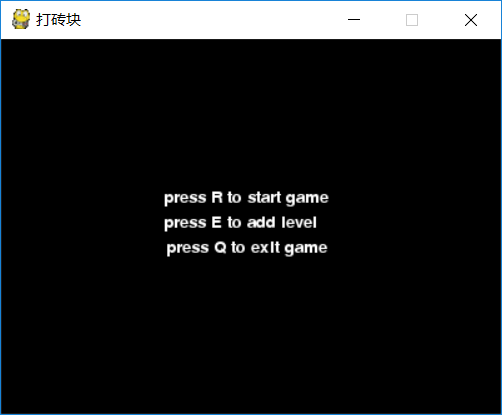
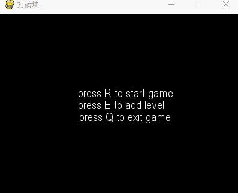
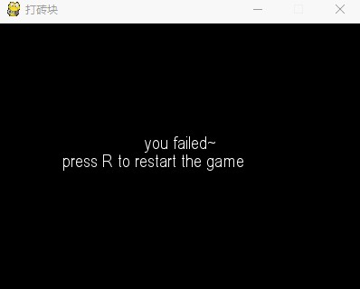

# 打砖块

游戏需要安装 pygame
```
pip3 install -r requirements.txt
```
运行游戏
```
python3 init.py
```

## 初始界面


1. 按R开始游戏
2. 按E添加关卡
3. 按Q退出游戏

## 游戏界面


1. 按空格进行发射子弹
2. 按左右键移动挡板
3. 按Q退出游戏

## 结束界面


1. 按R返回标题菜单重新开始
2. 按Q退出游戏

## 编辑画面


1. 按R放弃编辑
2. 按空格保存并回到标题菜单
3. 鼠标点击添加砖块